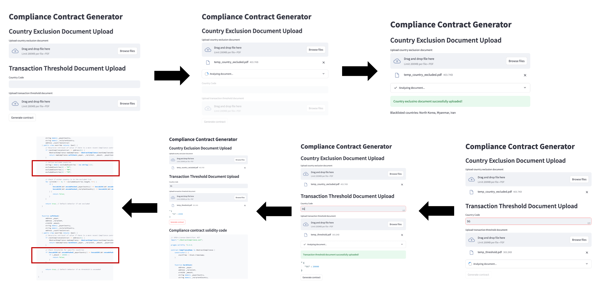

# NUS Fintech Summit 2025: AI-Powered Compliance Rule Mining Agent
## Group Members: Kenneth See, Xue Wen Tan

## Software Architecture


## Product Interface

### How to Set Up and Run the Code Locally

Follow the step-by-step guide below to try out the code on your local machine:

1. **Set Up the Environment**  
   Use the provided `environment.yml` file to create a Python environment with all necessary dependencies.  
   ```bash
   conda env create -f ./nlp_models/environment.yml
   conda activate fintech
   python -m spacy download en_core_web_trf
   ```

2. **Download Pre-trained Checkpoints**  
   Download the pre-trained BERT-Based Sequence Classifier checkpoints from the following link: [Download Checkpoints](https://drive.google.com/drive/folders/1lyG_6b007bT1MpdzX6yb7_48QsTOkt4j?usp=sharing)  
   Ensure that the checkpoints are saved in the correct directory as required by the code.
   ```bash
   mv *.pth ./nlp_models
   ```
   
4. **Run the Code**  
   Once the environment is set up and the checkpoints are downloaded, run the code using the appropriate script:  
   ```bash
   streamlit run app.py
   ```
   Once the app launches in your browser, select the first option on the local interface.
